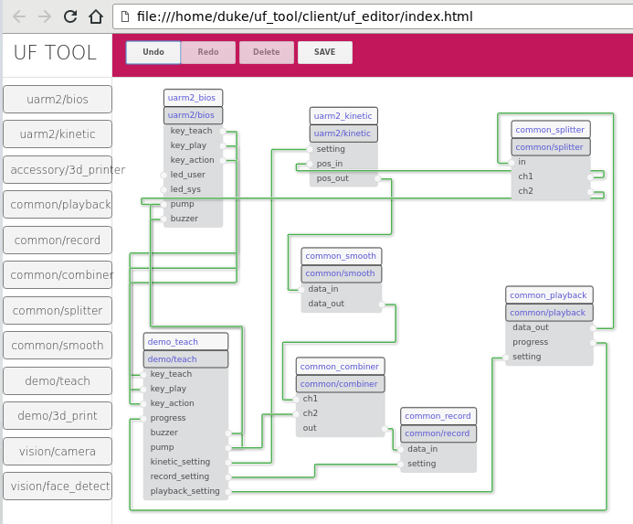
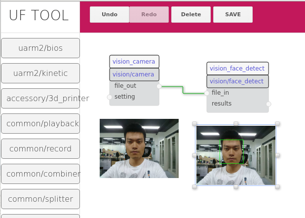

### Modular Programming

A complete project is build up by several modules,
one module could made by grouping several other modules.

If module corresponding to class, then node corresponding to object witch is an instance of the class.

Nodes communicate with each other through I/O ports,
there are two IO port types and two directions:

-  topic   input  (subscriber)
-  topic   output (publisher)
-  service input  (reply)
-  service output (request)

Both topic and service are identified by string in same name space,
the identifier string likes the path of unix-like file system by conventions,
e.g.: 'node1/port1' and 'node1/sub_node2/port1'

Topics are named buses over which nodes exchange messages.
Topics have anonymous publish/subscribe semantics,
which decouples the production of information from its consumption.
In general, nodes are not aware of who they are communicating with.
Instead, nodes that are interested in data subscribe to the relevant topic;
nodes that generate data publish to the relevant topic.
There can be multiple publishers and subscribers to a topic.

Topics are intended for unidirectional, streaming communication.
Nodes that need to perform remote procedure calls,
i.e. receive a response to a request, should use services instead.
Request/reply is done via a Service,
which is defined by a pair of messages: one for the request and one for the reply.
A providing node offers a service under a string name,
and a client calls the service by sending the request message and awaiting the reply.

Topic and service above are provided by the UFC (UFactory Communication) library,
which is a wrapper on the top of many messaging system,
which could be: in-process, ZeroMQ, ACH IPC, ROS or our own.  
(UFC currently only support in-process, and only implemented in python3.)

Topic and service provided by UFC are very similar to ROS, except:

- Unlike the ROS Topic, if any of the subscriber's queue is full and the allow_drop flag is False,
  the publisher will block.
- UFC doesn't know anything about the data you send except its size in bytes,
  that means you are responsible for formatting it safely.
  Doing this for objects and complex data types is a job for specialized libraries like Protocol Buffers.
  But we prefer to use strings, further strings could append with raw binary data (or use raw only).

#### Example Diagram

### GUI TOOL
Based on modular programming, we can use a GUI tool to edit the connections between nodes,
and can use the GUI tool to monitor or change status of nodes, and monitor data passing through the wires.

Demo of recording and playback:

Demo of face detection (port `results` output positions of detected faces):

This tool is under development currently, it will be published in the near future.

